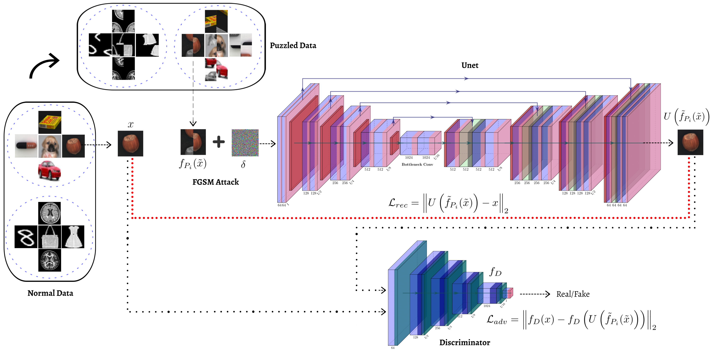

# Puzzle-AE: Novelty Detection In Images Through Solving Puzzles

This repository contains code for training and evaluating the proposed method in our paper [Puzzle-AE: Novelty Detection in Images through Solving Puzzles](https://arxiv.org/pdf/2008.12959.pdf).



## Citation
If you find this useful for your research, please cite the following paper:
``` bash
@misc{salehi2020puzzleae,
      title={Puzzle-AE: Novelty Detection in Images through Solving Puzzles}, 
      author={Mohammadreza Salehi and Ainaz Eftekhar and Niousha Sadjadi and Mohammad Hossein Rohban and Hamid R. Rabiee},
      year={2020},
      eprint={2008.12959},
      archivePrefix={arXiv},
      primaryClass={cs.CV}
}
```

## Clone this repo:
``` bash
git clone https://github.com/Niousha12/Puzzle_Anomaly_Detection.git
cd Puzzle_Anomaly_Detection
```
## Datsets:
This repository performs Novelty/Anomaly Detection in the following datasets: MNIST, Fashion-MNIST, CIFAR-10, COIL-100, MVTec AD, and 2 medical datasets (Head CT (hemorrhage) and Brain MRI Images for Brain Tumor Detection).

Datasets MNIST, Fashion-MNIST, and CIFAR-10 will be downloaded by Torchvision. You have to download COIL-100, [MVTec AD](https://www.mvtec.com/company/research/datasets/mvtec-ad/), [Head CT (hemorrhage)](http://www.kaggle.com/felipekitamura/head-ct-hemorrhage), and [Brain MRI Images for Brain Tumor Detection](http://www.kaggle.com/navoneel/brain-mri-images-for-brain-tumor-detection), and unpack them into the `Dataset` folder.


## Train the Model:
Start the training using the following command. The checkpoints will be saved in the folder `outputs/{dataset_name}/{normal_class}/checkpoints`.

Train parameters such as dataset_name, normal_class, batch_size and etc. can be specified in `configs/config_train.yaml`.
``` bash
python train.py --config configs/config_train.yaml
```

## Test the Trained Model:
Test parameters can be specified in `configs/config_test.yaml`.
``` bash
python test.py --config configs/config_test.yaml
```
